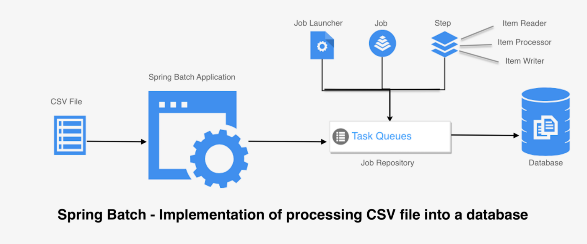
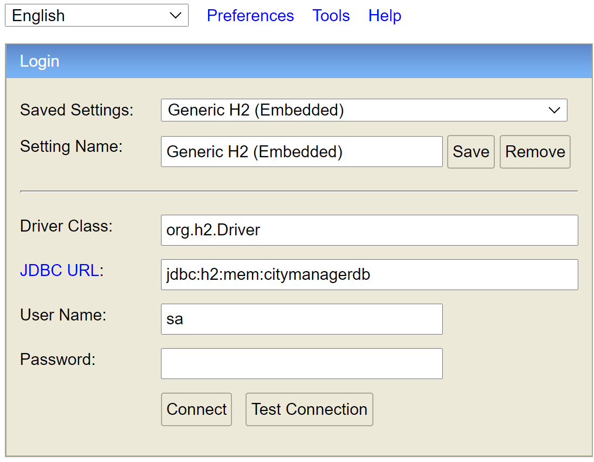
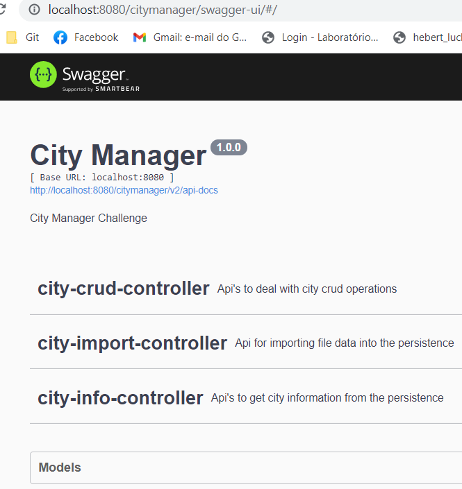
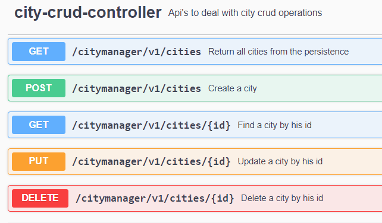
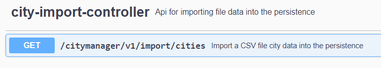
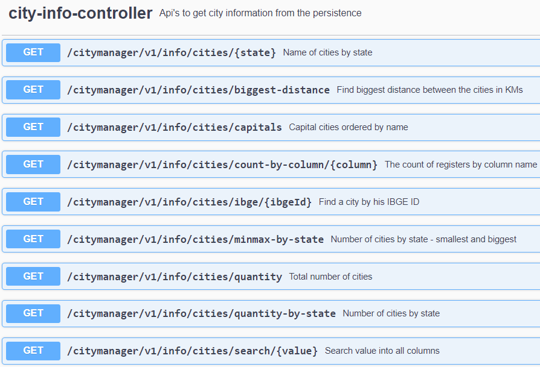

# Getting started
# Aplicação citymanager 
O aplicativo **City Manager** possui uma lista de cidades e processa esses dados para extrair várias informações.
Possui informações que são baseadas nos dados do arquivo CSV _**Desafio Cidades - Back End.csv**_ e exibe os seguintes resultados:

# Desafio
A empresa XPTO Systems precisa construir um sistema web para leitura e manutenção de uma lista de cidades que hoje está em um arquivo CSV.
Como a empresa está antenada com as novas tecnologias ela precisa de um sistema web, pois os usuários irão acessar os dados do sistema via smartphone.
A empresa contratou uma agência e a agência decidiu separar o trabalho em duas partes: uma equipe irá fazer a interface e equipe a integração com a base de dados.
Para a integração com a base de dados foi sugerida a criação de uma API rest para fazer o controle das cidades cadastradas. Todos o tráfego de dados do serviço deve ser feito no formato JSON.
Foi definido que a API terá serviços para atender os seguintes requisitos:
1. Ler o arquivo CSV das cidades para a base de dados;
2. Retornar somente as cidades que são capitais ordenadas por nome;
3. Retornar o nome do estado com a maior e menor quantidade de cidades e a
   quantidade de cidades;
4. Retornar a quantidade de cidades por estado;
5. Obter os dados da cidade informando o id do IBGE;
6. Retornar o nome das cidades baseado em um estado selecionado;
7. Permitir adicionar uma nova Cidade;
8. Permitir deletar uma cidade;
9. Permitir selecionar uma coluna (do CSV) e através dela entrar com uma string para
   filtrar. retornar assim todos os objetos que contenham tal string;
10. Retornar a quantidade de registro baseado em uma coluna. Não deve contar itens
    iguais;
11. Retornar a quantidade de registros total;
12. Dentre todas as cidades, obter as duas cidades mais distantes uma da outra com base
    na localização (distância em KM em linha reta);

## Requisitos

1. Java v15 - JDK 15.0.2
2. Maven v3.8.2
3. H2 database v1.4.200

## Dependecias utilizadas: 
1. **spring-boot-starter-batch** - Permite criar um schedule de jobs e várias outras operações de batch também podem ser utilizadas. Nessa aplicação foi utilizado para a importação do arquico CSV de cidades.



2. **h2** - H2 Database é uma "In memory light weight", e provê uma "Web browser based application console". 

3. Podemos acessar essa aplicação com a url abaixo: 
   ```
   http://localhost:8080/citymanager/h2-console/
   ```
   Para conectar no banco insira no campo url esse conteúdo **_jdbc:h2:mem:citymanagerdb_** e selecione o botão _Connect_.

    

## Clonando repositório GIT

```bash
$ git clone git@github.com:hebertluchetti/city-manager.git
```

O projeto será baixado na pasta `city-manager`.

### Branches

Branch principal do projeto.

* `master`: Projeto original em Java com Spring Boot

## Rodando o servidor localmente

Na raíz do projeto execute o comando `mvn spring-boot:run` e o servidor iniciará na porta 8080 (http://localhost:8080).
```bash
$ mvn spring-boot:run
```
## Importando dados para o H2 a partir do arquivo CSV

Utilizar o endpoint GET /citymanager​/v1​/import​/cities.
    ```
    http://localhost:8080/citymanager/v1/import/cities
    ```
## Explorando as Rest APIs ##
Nossa app define 12 Rest endpoints. 
A documentação dos endpoints pode ser encontrada no link abaixo: 
    ```
    http://localhost:8080/citymanager/swagger-ui.html#
    ```
    


Estão dividas em 3 controllers:
1. **city-crud-controller** :
    Nesse controller estão os endpoints de CRUD padrão **_Rest_** que são requisitos do desafio.



2. **city-import-controller** : 
   Nesse controller está o endpoint de importação de aruivo CSV que é requisito do desafio.



3. **city-info-controller** : 
   Nesse controller estão os endpoints de busca que são requisitos do desafio.



# Desafio
A empresa XPTO Systems precisa construir um sistema web para leitura e manutenção de uma lista de cidades que hoje está em um arquivo CSV.
Como a empresa está antenada com as novas tecnologias ela precisa de um sistema web, pois os usuários irão acessar os dados do sistema via smartphone.
A empresa contratou uma agência e a agência decidiu separar o trabalho em duas partes: uma equipe irá fazer a interface e equipe a integração com a base de dados.
Para a integração com a base de dados foi sugerida a criação de uma API rest para fazer o controle das cidades cadastradas. Todos o tráfego de dados do serviço deve ser feito no formato JSON.
Foi definido que a API terá serviços para atender os seguintes requisitos:

1. Ler o arquivo CSV das cidades para a base de dados
    ```
    # Request
    GET /citymanager​/v1​/import​/cities
    ```

2. Retornar somente as cidades que são capitais ordenadas por nome
    ```
    # Request
    GET ​/citymanager​/v1​/info​/cities​/capitals
    ```

3. Retornar o nome do estado com a maior e menor quantidade de cidades e a quantidade de cidades
    ```
    # Request
    GET /citymanager/v1/info/cities/minmax-by-state
    ```

4. Retornar a quantidade de cidades por estado
    ```
    # Request
    GET /citymanager/v1/info/cities/quantity-by-state
    ```
   
5. Obter os dados da cidade informando o id do IBGE
    ```
    # Request
    GET /citymanager/v1/info/cities/ibge/{ibgeId}
    ```

6. Retornar o nome das cidades baseado em um estado selecionado
    ```
    # Request
    GET /citymanager/v1/info/cities/{state}
    ```

7. Permitir adicionar uma nova cidade
    ```
    # Request
    POST /citymanager/v1/cities
    ```

8. Permitir deletar uma cidade
    ```
    # Request
    DELETE ​/citymanager​/v1​/cities​/{id}
    ```

9. Permitir selecionar uma coluna (do CSV) e através dela entrar com uma string para filtrar retornar assim todos os objetos que contenham tal string
    ```
    # Request
    GET /citymanager/v1/info/cities/search/{value}
    ```

10. Retornar a quantidade de registro baseado em uma coluna. Não deve contar itens iguais.
    ```
    # Request
    GET ​/citymanager​/v1​/info​/cities​/count-by-column​/{column}
    ```

11. Retornar a quantidade de registros total
    ```
    # Request
    GET /citymanager/v1/info/cities/quantity
    ```

12. Dentre todas as cidades, obter as duas cidades mais distantes uma da outra com base na localização (distância em KM em linha reta)
    ```
    # Request
    GET /citymanager​/v1​/info​/cities​/biggest-distance
    ```

Contact: Hebert Luchetti Ribeiro
```bash
email: hebert.luchetti@gmail.com
linkedin: https://www.linkedin.com/in/hebert-luchetti-ribeiro-aa42923
youtube: https://www.youtube.com/channel/UCf0w-raMzq6rNxxjNJ7D1gQ
github python: https://github.com/hebertluchetti/PythonAndDeepLearning
github java: https://github.com/hebertluchetti/city-manager
```
